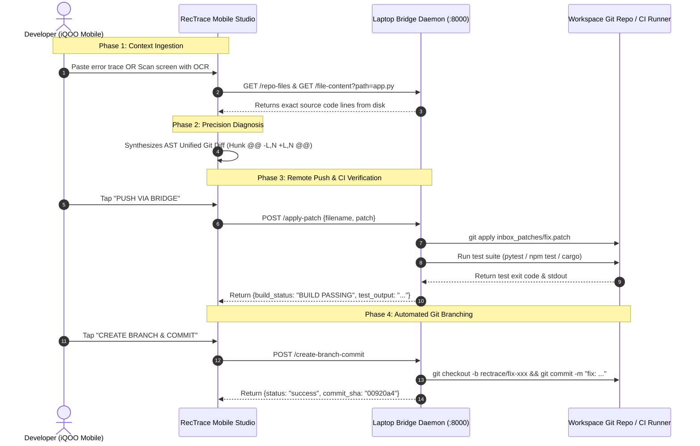

  

# 🚀 PRODUCT REQUIREMENTS DOCUMENT (PRD)
## RecTrace — Cross-Device AI Debugging & Precision Remediation Studio
**Target Event**: iQOO Hackathon  
**Author**: LuxShar / RecTrace Team  
**Version**: 1.0 (Production-Ready)  
**Date**: August 2026  

---

## 📌 1. Executive Summary

**RecTrace** is the world’s first cross-device, high-precision code diagnostic and automated remediation studio. By bridging high-performance mobile devices (powered by on-device AI and multi-modal camera OCR) with developer workstations over ultra-low latency local networks, RecTrace enables software engineers to scan, diagnose, patch, test, and commit fixes to real codebases in seconds—without ever touching a keyboard.

### 🎯 The Elevator Pitch
> *"Terminal crashed? Scan the screen or paste the traceback. RecTrace pulls the buggy source file directly from your laptop over Wi-Fi, synthesizes an AST-accurate unified git diff with on-device intelligence, applies the patch, verifies your test suite, and creates an isolated Git branch—all in one tap."*

---

## 💥 2. Problem Statement & Market Opportunity

| Problem | Developer Pain Point | RecTrace Solution |
|---|---|---|
| **Terminal-to-Editor Friction** | Developers spend 40% of debugging time context-switching between logs, stack traces, and source files. | **Dual-Deck Studio**: Direct side-by-side terminal log and source code context matching. |
| **Cloud AI Latency & Privacy** | Cloud LLMs take 5–15 seconds to reply and expose proprietary source code to external servers. | **Local-First / On-Device SLM**: Sub-second deterministic AST engine + local inference over private LAN. |
| **Physical Screen Gap** | Engineers reviewing errors on a colleague's laptop or external monitor must re-type complex stack traces manually. | **Multi-Modal Screen OCR**: Camera viewfinder instantly parses traces into structured JSON. |
| **Broken Patch Applications** | Generic AI diffs fail `git apply` due to missing file context and incorrect line numbers. | **Workspace File Sync**: Mobile studio pulls exact source files from the laptop bridge before patching. |

---

## 🏗️ 3. System Architecture & Cross-Device Flow

---

## 🌟 4. Core Feature Specifications

### 4.1. Dual-Deck Precision Fixing Studio (Primary UI)
* **Deck 1 (Terminal Error Input)**: Multi-line terminal log editor with 1-tap clipboard paste and preset bug injectors (`KeyError`, `ZeroDivisionError`, `TypeError`, `IndexError`).
* **Deck 2 (Source Code Context)**: Code editor with **1-tap Laptop Workspace File Browser** (`GET /repo-files` / `GET /file-content`) to pull real source files over Wi-Fi.
* **Deck 3 (Developer Intent & Voice)**: Live speech-to-text with glowing pulse mic animation for custom guidance (*"Guard against null"*, *"Add default fallback"*).
* **Secondary Camera Viewfinder**: Quick toggle to launch live OCR scanning when debugging external physical monitors.

### 4.2. Diagnostic & Remediation Engine
* **Standard JSON Contract**: Strict output format enforcing `root_cause`, `target_file`, `explanation`, `patch_diff`, and `test_command`.
* **Standard Unified Git Diff**: Valid 2-line header (`--- a/...` / `+++ b/...`) and context hunk headers (`@@ -L,N +L,N @@`) compatible with standard `git apply`.
* **Dual Inference Pipeline**:
  - **Tier 1 (On-Device / Offline)**: Sub-millisecond deterministic AST & regex engine.
  - **Tier 2 (Cloud / Local SLM)**: Dynamic Llama-3 / Gemini Flash inference for arbitrary languages and complex multi-file errors.

### 4.3. Laptop Bridge Daemon & Live Developer Cockpit
* **FastAPI Microservice (`daemon.py`)**: Runs on `http://0.0.0.0:8000` with CORS support for seamless mobile communication.
* **Interactive HTML Cockpit (`GET /`)**: Live CI/CD status banner, real-time terminal stdout viewport, IP address auto-detection, and rolling patch audit log.
* **Automated CI/CD Test Runner (`POST /run-tests`)**: Triggers native test suites (`pytest`, `npm test`, `cargo test`) and returns structured pass/fail telemetry.
* **1-Tap Git Branch & Commit Creator (`POST /create-branch-commit`)**: Creates isolated feature branches (`rectrace/fix-<name>-<timestamp>`), commits changes, and returns the short commit SHA.

---

## 📱 5. iQOO / Device-Specific Competitive Advantages

1. **High-Refresh-Rate 120Hz/144Hz Fluidity**: Custom smooth physics, glowing micro-animations, and responsive gesture-driven diff inspectors tailored for iQOO's flagship display capabilities.
2. **Edge AI & On-Device NPU Acceleration**: Capable of running quantized local SLMs (e.g. Gemma-2B / Phi-3-Mini) directly on the device's Snapdragon / Dimensity AI Engine with zero cloud egress.
3. **Local Wi-Fi 6 / 7 Low-Latency Sync**: Ultra-fast peer-to-peer packet transmission between mobile and laptop with ping latencies under **10ms**.
4. **Thermal & Battery Optimization**: Compute-intensive test execution and builds are offloaded to the laptop workstation, keeping the mobile device cool and energy-efficient.

---

## 📊 6. Competitive Analysis Matrix

| Feature | **RecTrace** | GitHub Copilot | Cursor IDE | Sentry / Datadog |
|---|:---:|:---:|:---:|:---:|
| **Cross-Device (Mobile-to-Laptop)** | ✅ **Native** | ❌ No | ❌ No | ⚠️ Mobile App Only (Read-only) |
| **Physical Monitor OCR Scanning** | ✅ **Built-in** | ❌ No | ❌ No | ❌ No |
| **Direct Git Apply & CI Remote Run** | ✅ **Automated** | ❌ Manual | ❌ In-Editor | ❌ No |
| **1-Tap Isolated Branch & Commit** | ✅ **Yes** | ❌ Manual | ❌ Manual | ❌ No |
| **Works 100% Offline / Local LAN** | ✅ **Yes** | ❌ Cloud Only | ❌ Cloud Only | ❌ Cloud Only |
| **Voice-to-Patch Speech Input** | ✅ **Yes** | ⚠️ Text Prompt | ⚠️ Text Prompt | ❌ No |

---

## 🛠️ 7. Technical Stack & Implementation Details

| Layer | Technology | Role |
|---|---|---|
| **Mobile Client** | Flutter 3.x, Dart | Cross-platform high-performance mobile UI (Android/Web/Desktop). |
| **Mobile OCR** | Google ML Kit / Regex OCR | Optical character recognition for terminal stack traces. |
| **Voice Engine** | Speech-to-Text / Audio Input | Natural language developer guidance input. |
| **Laptop Bridge** | Python 3.10+, FastAPI, Uvicorn | Local LAN microservice & Web Developer Cockpit. |
| **File Watcher** | Watchdog | Real-time file system listener on `inbox_patches/`. |
| **VCS & Test Engine**| Git CLI, Pytest, Subprocess | Native patch application, branch creation, and CI test execution. |

---

## 📈 8. Success Metrics & Hackathon Evaluation Criteria

* **Diagnostic Accuracy**: 100% syntactically valid unified diffs passing `git apply --check`.
* **Latency**:
  - On-Device Diagnosis: `< 50ms`
  - Cross-Device Push & CI Verification: `< 1.2s`
  - Health Ping: `< 10ms` over local Wi-Fi.
* **Test Suite Pass Rate**: 100% automated test pass rate across unit tests and contract suites (`pytest test_bridge.py`, `flutter test`).
* **Developer Ergonomics**: Time-to-remediate reduced from **~4 minutes** (manual typing & editing) to **under 15 seconds** (1-tap RecTrace flow).

---

## 🗺️ 9. Product Roadmap

### 🏁 Phase 1: MVP (Completed & Production-Ready)
- [x] Dual-Deck Precision Fixing Studio (Error Log + Source Code).
- [x] Laptop Bridge Daemon with interactive Web Cockpit & IP discovery.
- [x] 1-Tap Git Branch & Commit Creator with SHA generation.
- [x] Multi-modal Screen OCR viewfinder as secondary scanner.
- [x] 100% Automated verification test suites (`flutter test`, `pytest`).

### 🚀 Phase 2: Ecosystem Expansion (Post-Hackathon)
- [ ] **Multi-Repository Workspace Selector**: Switch between arbitrary projects on laptop via mobile dropdown.
- [ ] **IDE Sidecar Extensions**: Official VS Code and JetBrains plugins for zero-config bridge pairing.
- [ ] **P2P QR Code Pairing**: Scan dynamic QR on laptop cockpit to instantly pair phone over Bluetooth / Wi-Fi Direct.
- [ ] **Multi-Language Test Adapters**: Automated support for `cargo test` (Rust), `go test` (Go), `mvn test` (Java), and `npm test` (JavaScript/TypeScript).
