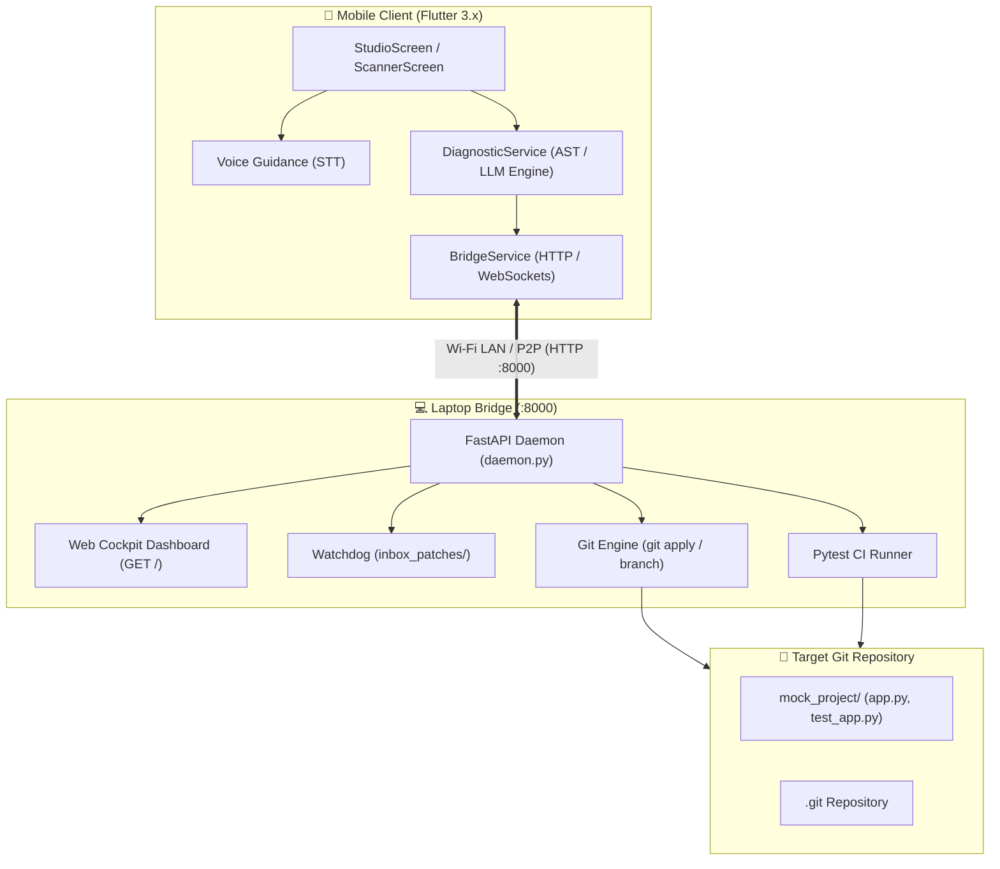

<div align="center">


# ⚡ RecTrace
### *Cross-Device AI Debugging & Precision Code Remediation Studio*

[](https://github.com/LuxShar007/RecTrace)
[](https://flutter.dev)
[](https://fastapi.tiangolo.com)
[](#)
[](LICENSE)

<br />

> **Terminal crashed on your laptop?**  
> Scan the screen or paste the traceback into your phone. RecTrace pulls the target source file from your laptop over Wi-Fi, synthesizes an AST-accurate unified git diff with on-device intelligence, applies the patch, verifies your test suite, and commits to an isolated Git branch—**in one tap**.

<br />

```
 ┌────────────────────────────────────────────────────────────────────────────────────────┐
 │                                   RECTRACE WORKFLOW                                    │
 │                                                                                        │
 │   [📱 Mobile Studio]         [⚡ Local Wi-Fi]          [💻 Laptop Bridge Daemon]        │
 │   ──────────────────         ────────────────          ─────────────────────────       │
 │   1. Traceback Input    ──►  GET /file-content   ──►   Read source from disk           │
 │   2. AST Unified Diff   ◄──  (Source Code Sync)  ◄──   Return exact lines              │
 │   3. Tap "Push Fix"     ──►  POST /apply-patch   ──►   git apply inbox/fix.patch       │
 │   4. Verified Green     ◄──  BUILD PASSING       ◄──   python -m pytest                │
 │   5. 1-Tap Branch       ──►  /create-branch      ──►   git checkout -b && git commit   │
 └────────────────────────────────────────────────────────────────────────────────────────┘
```

</div>

---

## 🌟 Key Features

<table>
  <tr>
    <td width="50%">
      <h3 align="center">🛠️ Precision Fixing Studio</h3>
      <p>Dual-deck editor comparing <strong>Terminal Error Stack Traces</strong> against <strong>Source Code Context</strong>. No hallucinations—patches are generated against actual code lines from your workspace.</p>
    </td>
    <td width="50%">
      <h3 align="center">📂 Laptop Workspace Sync</h3>
      <p>1-tap file browser connects to your laptop daemon (<code>GET /repo-files</code>) to pull source code directly into your phone over local Wi-Fi with sub-10ms latency.</p>
    </td>
  </tr>
  <tr>
    <td width="50%">
      <h3 align="center">📷 Multi-Modal Camera OCR</h3>
      <p>Debugging a physical monitor or a teammate's laptop? Toggle the camera viewfinder to instantly extract clean stack traces and error signatures from screen pixels.</p>
    </td>
    <td width="50%">
      <h3 align="center">🌿 1-Tap Git Branch & Commit</h3>
      <p>Once the patch passes automated CI verification (<code>BUILD PASSING</code>), tap <strong>"CREATE BRANCH & COMMIT"</strong> to isolate the fix in a dedicated Git branch with a semantic commit message and SHA.</p>
    </td>
  </tr>
  <tr>
    <td width="50%">
      <h3 align="center">🧪 Automated CI/CD Engine</h3>
      <p>Runs native test runners (<code>pytest</code>, <code>npm test</code>, <code>cargo test</code>) on the laptop bridge upon patch arrival and streams live pass/fail results back to your phone.</p>
    </td>
    <td width="50%">
      <h3 align="center">🔒 100% Local & Privacy First</h3>
      <p>Zero cloud dependencies required. Works completely offline on your local network (LAN / P2P) with high-speed deterministic heuristic AST parsing.</p>
    </td>
  </tr>
</table>

---

## 🏗️ System Architecture



---

## 🚀 Quickstart Guide

### Prerequisites
- **Flutter SDK** (`>= 3.0.0`)
- **Python** (`>= 3.10`) with `pip`
- **Git** installed on PATH

---

### 1️⃣ Start the Laptop Bridge Daemon

```bash
# Navigate to laptop bridge directory
cd laptop-bridge

# Install dependencies
pip install -r requirements.txt

# Start the bridge daemon (runs on http://0.0.0.0:8000)
python daemon.py
```

> 🌐 **Developer Cockpit**: Open **`http://localhost:8000`** in your browser to view the real-time CI status, IP endpoints, and patch history.

---

### 2️⃣ Launch the Mobile Client

```bash
# Navigate to mobile client directory
cd mobile-client

# Install Flutter dependencies
flutter pub get

# Run on Chrome Web
flutter run -d chrome --web-port=3000

# OR Run on connected Android / iOS device
flutter run
```

---

## 🎮 10-Second Live Demo Flow

1. Open **`http://localhost:3000`** (Mobile Studio) and **`http://localhost:8000`** (Laptop Cockpit).
2. In the Mobile Studio, click the magic wand icon (`✨`) and select **`🐍 KeyError: "role"`**.
3. In **Deck 2 (Source Code)**, click the file dropdown to load `app.py` directly from your laptop.
4. Click **`⚡ ANALYZE & GENERATE PRECISION FIX`**.
5. Click **`PUSH VIA BRIDGE`** ➔ Watch your laptop apply the patch and verify `BUILD PASSING`!
6. Click **`🌿 CREATE BRANCH & COMMIT`** ➔ An isolated branch `rectrace/fix-app-xxxx` is created with a new commit SHA.

---

## 📊 Live Verification & Test Suite

Both the Laptop Bridge and Mobile Client include automated integration and unit test suites:

```bash
# Run Laptop Bridge end-to-end tests
cd laptop-bridge
python test_bridge.py
# Output: ALL VERIFICATION CHECKS PASSED SUCCESSFULLY! [✓]

# Run Mobile Client unit & widget tests
cd mobile-client
flutter test
# Output: All 7 tests passed! [✓]
```

---

## 📁 Repository Structure

```
RecTrace/
├── laptop-bridge/              # 💻 Python FastAPI Local Bridge & CI Engine
│   ├── daemon.py               # Microservice, Web Cockpit & Git watcher
│   ├── test_bridge.py          # End-to-end bridge test suite
│   ├── requirements.txt        # Python dependencies (fastapi, watchdog, pytest)
│   └── mock_project/           # Real target testbed repository
│       ├── app.py              # Application source code
│       └── test_app.py         # Pytest verification suite
│
├── mobile-client/              # 📱 Flutter Cross-Platform Mobile Client
│   ├── lib/
│   │   ├── main.dart           # App entry point
│   │   ├── screens/
│   │   │   ├── studio_screen.dart           # Primary dual-deck fixing studio
│   │   │   ├── patch_inspector_screen.dart  # Diff viewer & CI pipeline modal
│   │   │   └── scanner_screen.dart          # Secondary Camera OCR viewfinder
│   │   ├── services/
│   │   │   ├── diagnostic_service.dart      # Precision AST/LLM diagnostic engine
│   │   │   ├── bridge_service.dart          # Laptop HTTP bridge communicator
│   │   │   ├── ocr_service.dart             # Stack trace text parser
│   │   │   └── voice_service.dart           # Speech-to-text input
│   │   └── widgets/
│   │       ├── diff_viewer.dart             # Syntax-highlighted unified diff box
│   │       └── pulse_mic_button.dart        # Glowing ripple mic animation
│   └── test/
│       ├── diagnostic_service_test.dart     # Contract & AST integration tests
│       └── widget_test.dart                 # Widget initialization test
│
├── inbox_patches/              # 📥 Shared file watcher folder for .patch files
├── PRD.md                      # 📄 Product Requirements Document (iQOO Hackathon)
└── README.md                   # 📖 Documentation & Setup Guide
```

---

<div align="center">
  <sub>Built with ❤️ for the <strong>iQOO Hackathon</strong> by <strong>LuxShar</strong></sub>
</div>
